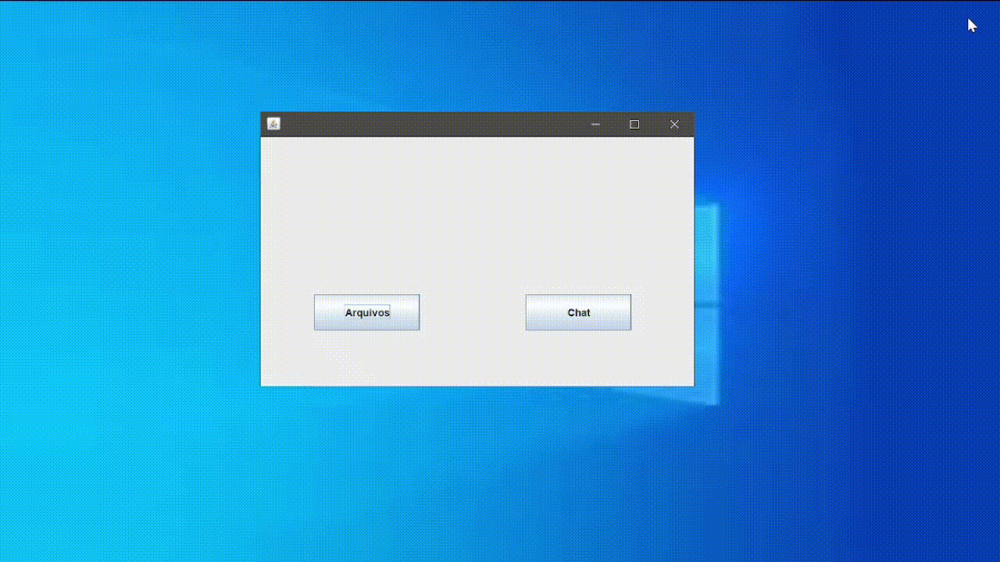

<h1 align="center">Sprint 1: 04/09/2023 a 24/09/2023</h1>

    <a href="#objetivos">Objetivos da sprint</a> &nbsp |&nbsp &nbsp
    <a href="#entregas">Entregas</a>

 

Como parte da API do 2° semestre do curso de análise e desenvolvimento de sistemas, da faculdade Fatec São José dos Campos, um desafio é proposto aos alunos. O desafio proposto foi a criação de um chat bot utilizando a linguagem de programação java junto da biblioteca [langchain4j](https://github.com/langchain4j), responsável por fazer a leitura, embedding e interpretação do arquivo desejado. O projeto consiste em um sistema com funcionalidades de gerenciamento de usuários, chamados, geração de relatórios, entre outras ações do contexto. Tendo em mente o MVP, a primeira sprint se deu com a criação de um fluxo básico de criação de usuários, login e listagem de chamados, bem como o acompanhamento desses chamados com sua abertura, análise e fechamento. Para isso, foram levantados e validados os requisitos e o protótipo, construindo os serviços e interfaces visando uma entrega de grande valor condizente com a dor do cliente.

    
## :dart: Objetivos da Sprint
Os requisitos (tanto do cliente como da instituição de ensino) abrangidos por essa sprint são:
- **RF 01:** Carregamento de arquivos
- **RF 02:** conversa e resposta com o chatbot
- **RNF 01:** Utilizar Java

        
## :heavy_check_mark: Entregas
Para entregas da sprint, tivemos os artefatos SCRUM validados, como Backlog do Produto, Backlog das Sprints e User Stories, através de comunicação direta entre o P.O. e o cliente.

Para extrair e entender os desejos do cliente, foi construído um protótipo inicial no Figma, criando a identidade visual e design do sistema e apresentando para validação com o cliente. O resultado deste protótipo, com a integração das funcionalidades acordadas para a primeira sprint pode ser observado a seguir:

### RF 01: Carregamento de arquivos

Este requisito se trata da possibilidade de carregar arquivos para o sistema do chat bot, neste primeiro momento o programa so funciona com arquivos .txt em ingles, mas futuramente o objetivo é a implementação de arquivos PDF e CSV e a lingua portuguesa.

### RF 02: Conversa com chat bot

Este requisito se trata da possibilidade de perguntar qualquer coisa relacionada ao arquivo carregado, tendo uma resposta gerada com dados carregados, existe algumas imprecisões nas respostas devido ao fato de ser uma primeira versão, nas futuras sprints o funcionamento será otimizado.

→ [Voltar ao topo](#topo)
